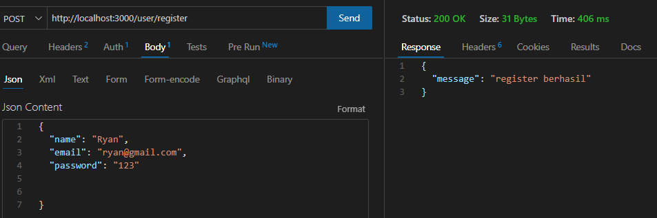
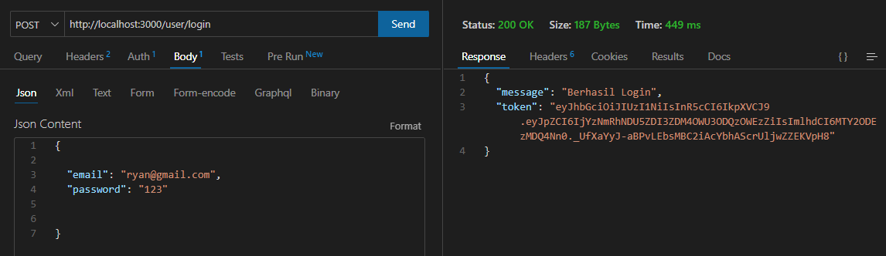
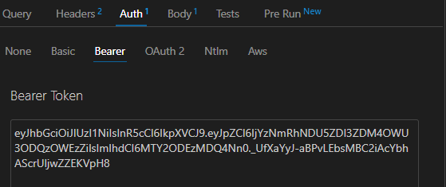
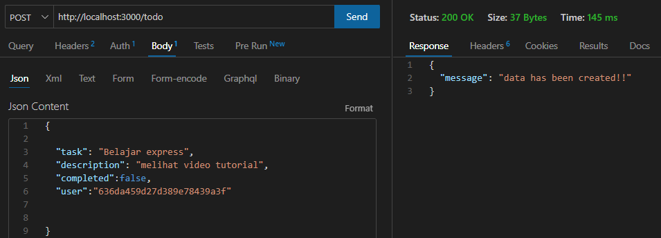
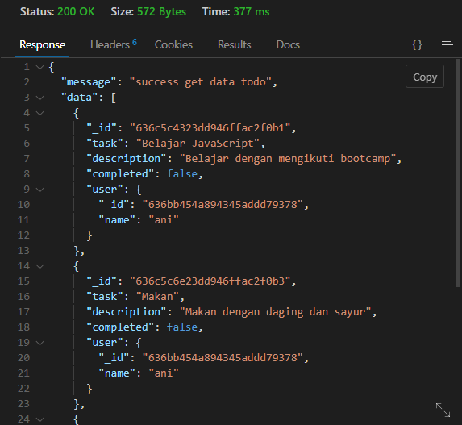
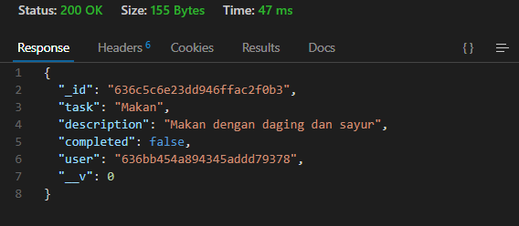
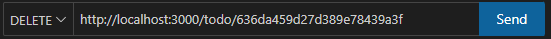
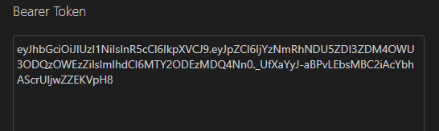
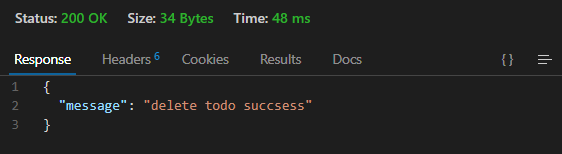
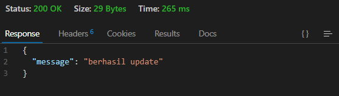

# Web Service & RESTful API for ToDoList Application
  
  Disini saya membuat Web Service & RESTful API for ToDoList Application dengan database mongodb

  1. Register
     
     Untuk proses awal,user diharapkan melakukan register terlebih dahulu.Untuk melakukan register user 
     menggunakan endpoint: 
     
     

     User mengetikkan endpoint di atas, Kemudian user menambahkan datanya.Jika berhasil maka akan memberikan respon berupa status 200(Ok) dan sebuah message berhasil register.

     

     Jika gagal maka akan memberikan respon berupa status 500(error) dan message failed register.

2. Login
     
     Setelah register,user melakukan login terlebih dahulu untuk mendapatkan token.Untuk melakukan login user 
     menggunakan endpoint: 
     
     

     User mengetikkan endpoint di atas, Kemudian user menambahkan datanya.Jika berhasil maka akan memberikan respon berupa status 200(Ok), sebuah message berhasil login,dan sebuah token.

    

     Jika gagal maka akan memberikan respon berupa status 500(error) dan message gagal login. 

3. Membuat todo baru

   Untuk membuat todo baru,user harus memasukkan token terlebih dahulu.untuk menambahkan token,bisa di bagian auth-> bearer token dan untuk endpointnya yaitu :

     

       

   User mengetikkan endpoint di atas, Kemudian user menambahkan token dan datanya.Jika berhasil maka akan memberikan respon berupa status 200(Ok) dan sebuah message data berhasil dibuat.
   
     

   Apabila user tidak memasukkan token maka akan muncul message internal server error dan status 500(error) begitu juga jika terdapat kesalahan saat menambahkan data.  

4. Melihat semua todo
   
   Untuk melihat semua todo,user dapat menggunakan endpoint dibawah ini: 
     
   

   User mengetikkan endpoint di atas.Jika berhasil maka akan memberikan respon berupa status 200(Ok) dan sebuah message berhasil mendapatkan data.

   

   Jika gagal maka akan memberikan respon berupa status 500(error) dan message internal server error.

5. Melihat todo berdasarkan id
   
   Untuk melihat semua todo berdasarkan id,user dapat menggunakan endpoint dibawah ini: 
     
   

   User mengetikkan endpoint di atas.Jika berhasil maka akan memberikan respon berupa status 200(Ok) dan sebuah message berhasil mendapatkan data.

   

   Jika gagal maka akan memberikan respon berupa status 404(not found) dan message todo not found.

6. Menghapus todo berdasarkan id

   Untuk menghapus todo berdasarkan id,user harus memasukkan token terlebih dahulu.untuk menambahkan token,bisa di bagian auth-> bearer token dan untuk endpointnya yaitu :

     

       

   User mengetikkan endpoint di atas.Jika berhasil maka akan memberikan respon berupa status 200(Ok) dan sebuah message data berhasil dihapus.
   
     

   Apabila user tidak memasukkan token maka akan muncul message internal server error dan status 500(error) begitu juga jika terdapat kesalahan saat menghapus data.  

7. Mengupdate todo
   
   Untuk mengedit todo berdasarkan id,user harus memasukkan token terlebih dahulu.untuk menambahkan token,bisa di bagian auth-> bearer token dan untuk endpointnya yaitu :

     

       

   User mengetikkan endpoint di atas.Jika berhasil maka akan memberikan respon berupa status 200(Ok) dan sebuah message data berhasil diupdate.
   
     

   Apabila user tidak memasukkan token maka akan muncul message internal server error dan status 500(error) begitu juga jika terdapat kesalahan saat mengedit data.  

8. Menghapus todo all

   Untuk menghapus semua todo,user harus memasukkan token terlebih dahulu.untuk menambahkan token,bisa di bagian auth-> bearer token dan untuk endpointnya yaitu :

     

       

   User mengetikkan endpoint di atas.Jika berhasil maka akan memberikan respon berupa status 200(Ok) dan sebuah message data berhasil dihapus.
   
     

   Apabila user tidak memasukkan token maka akan muncul message internal server error dan status 500(error) begitu juga jika terdapat kesalahan saat menghapus data.  

   

   

